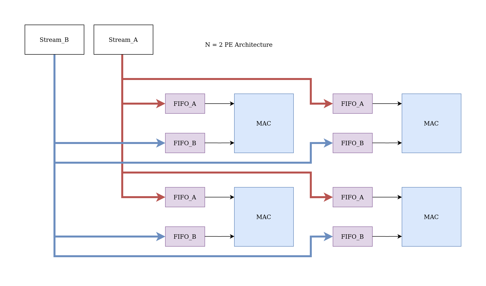
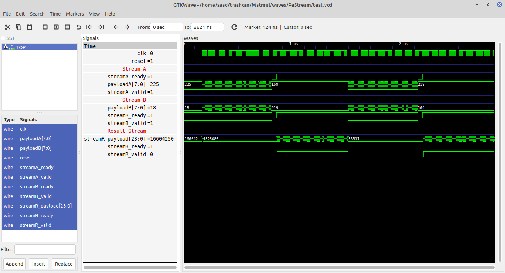
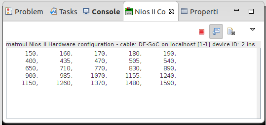

# Matmul: Hardware Matrix Multiplier Generator
The goal of this project is to create a configurable Integer Matrix Multiplier 
using SpinalHDL. The multiplier has 2 streaming input ports and 1 streaming 
output port. The elements are streamed in order a11, a12 ... a1n, a21 ... ann.
The results are streamed out in the same order. This makes it possible to 
chain multiplication by connecting outputs to inputs of other Multipliers.

## Architecture 
The architecture of a PE (Processing Engine) is a simple 2D array of MAC units with FIFOs for synchronization.
The input elements get fed into their respective FIFO (only the elements that are needed in
the calculation are pushed into the FIFO, this is accomplished via Counters tracking the 
coordinates of the element) as they arrive and are fed into the MAC when both `a` and `b` 
inputs are ready. The FIFOs are `N` deep where `N` is the dimension of the MAC Array. Thanks
to the FIFOs, streams `A` and `B` need not be synchronized.

The MAC itself is a 3 stage pipeline

Since all the computations happen in parallel, the PE only needs 3 more cycles after `a` 
and `b` matrices have been streamed into it to finish the computation. After that it will 
begin streaming the results, clear the MACs and begin accepting new inputs.

Assuming Data is sent every clock cycle, `N^2 + 3` cycles are needed for
the computation and `N` more cycles to transfer the results



## Variants
 - Streaming Outputs (`PeStream`): The outputs are streamed one value at a time
 - MemoryMapped Outputs (`PeMM`, NOT TESTED): The outputs are available 3 cycles after 
 inputs
 have been streamed accessed with a simple MM interface

## Interfaces
 - Stream: `valid/ready/payload` interface directly pin compatible with
 Avalon-ST interface (DMA ready)
 
 - MM: (NOT READY)

## FPGA Area/Frequency (`PeStream`)

| FPGA | PeConfig | Area | Fmax |
| --- | --- | --- | ---|
| Cyclone II | N = 5, 16 bit input, 32 bit output, mlab = false | 9,389 LEs, 50 9-bit Mults | 172.95 MHz |
| Cyclone II | N = 5, 8 bit input, 16 bit output, mlab = false | 5,033 LEs, 25 9-bit Mults| 196.43 MHz |

Numbers obtained from Quartus 13.0 with Optimization = Speed

## Demo Project
In the `de10nano` directory is a Demo project that 
couples a N=5, 16-bit in, 32-bit out PE with Altera's 
modular SGDMAs and a NIOS-II/e on a DE10 Nano board
(Cyclone V SoC) at 130 MHz. In the directory is the Quartus project,
Qsys system and NIOS-II Eclipse project. Uses a `Makefile`
to build the HW `.sof` and program it

The C code uses the DMAs to transfer data to/from the 
PE and then prints the output on JTAG-UART console 

```C
#define DIM   5
#define SIZE  (DIM*DIM)

volatile uint16_t A [SIZE] = {
    0,  1,  2,  3,  4,
    5,  6,  7,  8,  9,
    10, 11, 12, 13, 14,
    15, 16, 17, 18, 19,
    20, 21, 22, 23, 24
};

volatile uint16_t B [SIZE] = {
    0,  1,  2,  3,  4,
    5,  6,  7,  8,  9,
    10, 11, 12, 13, 14,
    15, 16, 17, 18, 19,
    20, 21, 22, 23, 24
};
```
Product:


## Directory Layout
 - `src/*`: SpinalHDL sources and tests
 - `de10nano/*`: Quartus demo project
 - `de10nano/software`: NIOS-II application
 - `PeStream.v`: Verilog source file needed for Qsys generate
 - `de10nano/Matmul_hw.tcl`: Qsys component for PE
 - `jar/*`: Contains the generator jar
 
## Dependencies
 - `SpinalHDL`
 - `scalatest`
 - `scallop`

## Running the generator
 - Use IDEA OR
 - Run the jar file `jar/Matmul.jar`